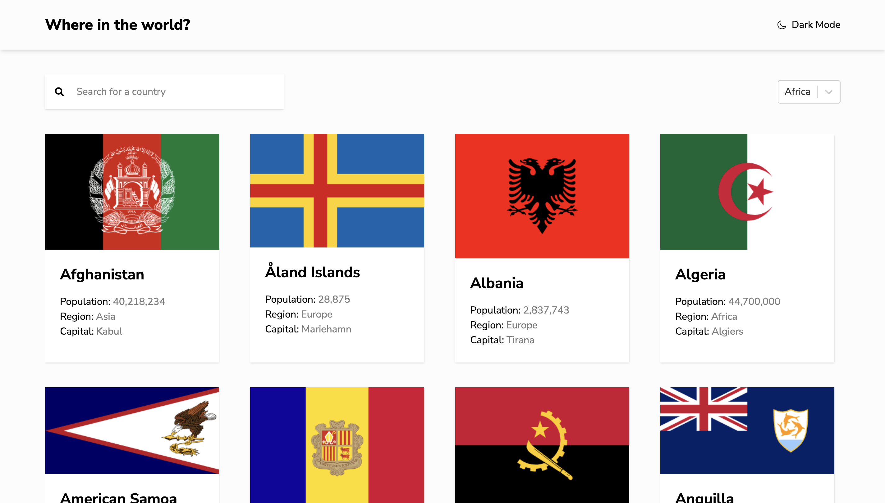

# Frontend Mentor - REST Countries API with color theme switcher solution

This is my solution to the [REST Countries API with color theme switcher challenge on Frontend Mentor](https://www.frontendmentor.io/challenges/rest-countries-api-with-color-theme-switcher-5cacc469fec04111f7b848ca). This project helped me sharpen my frontend skills by building a realistic app using REST APIs, dark/light themes, and dynamic routing.

## Table of contents

- [Overview](#overview)
  - [The challenge](#the-challenge)
  - [Screenshot](#screenshot)
  - [Links](#links)
- [My process](#my-process)
  - [Built with](#built-with)
  - [What I learned](#what-i-learned)
  - [Continued development](#continued-development)
  - [Useful resources](#useful-resources)
- [Author](#author)
- [Acknowledgments](#acknowledgments)

---

## Overview

### The challenge

Users should be able to:

- See all countries from the REST Countries API on the homepage
- Search for a country using an `input` field
- Filter countries by region
- Click on a country to see more detailed information on a separate page
- Click through to the border countries on the detail page
- Toggle the color scheme between light and dark mode

### Screenshot



### Links

- **Solution URL:** [https://github.com/ademto/rest-countries-api](https://github.com/ademto/rest-countries-api)
- **Live Site URL:** [https://rest-countries-ademto.netlify.app](https://rest-countries-ademto.netlify.app)

---

## My process

### Built with

- Semantic HTML5
- Tailwind CSS
- Flexbox & CSS Grid
- Mobile-first workflow
- [React](https://reactjs.org/)
- [Vite](https://vitejs.dev/)
- [REST Countries API](https://restcountries.com/)

### What I learned

- How to integrate a RESTful API in a real-world app
- Theme toggling (dark/light) using custom logic and Tailwind classes
- React Router for dynamic routing
- Filtering and searching through API data efficiently

#### Example code

```js
const fetchCountries = async () => {
  const res = await fetch("https://restcountries.com/v3.1/all");
  const data = await res.json();
  setCountries(data);
};
```

### Continued development

I want to improve:

- Accessibility (keyboard navigation and ARIA labels)
- Unit testing with Jest and React Testing Library
- Code splitting and lazy loading components

### Useful resources

- [REST Countries API](https://restcountries.com/)
- [React Router Docs](https://reactrouter.com/en/main)
- [Tailwind CSS Docs](https://tailwindcss.com/docs)

---

## Author

- Website – [emmanueladetoro.com](https://emmanueladetoro.com)
- Frontend Mentor – [@ademto](https://www.frontendmentor.io/profile/ademto)
- Twitter – [@ademto\_](https://twitter.com/ademto_)

---

## Acknowledgments

Thanks to the Frontend Mentor community for the helpful feedback and discussions around this challenge.
